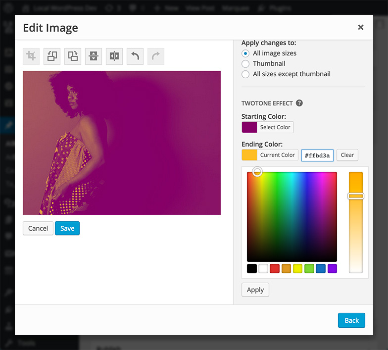

# Twotone FX

Apply a duotone effect to photos in the WordPress media library.

__Contributors:__ [Brady Vercher](https://twitter.com/bradyvercher), [Brody Vercher](https://twitter.com/brover)  
__Requires:__ WordPress 4.3+  
__License:__ [GPL-2.0+](http://www.gnu.org/licenses/gpl-2.0.html)

  
_Image editor with a section for adding a duotone effect to a photo._

## Installation

*Twotone FX* is available in the [WordPress plugin directory](http://wordpress.org/plugins/twotonefx/), so it can be installed from your admin panel.
